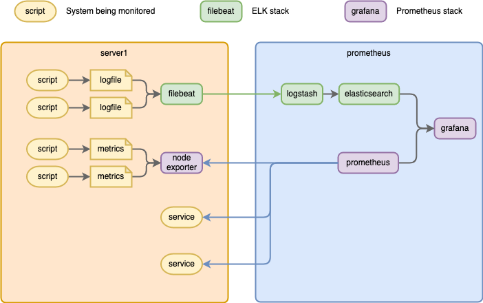

Combines:
- ELK stack (largely based on https://github.com/deviantony/docker-elk/)
- Prometheus stack

# Usage

## Run docker compose

From the main directory:

```
docker compose up -d
```

Run this after any changes as well.

This almost always does the right thing -- it does any necessary updates, restarts/starts services, etc.

## Set up grafana

1. Go to http://localhost:3000/
2. Log in as admin/admin
3. Set up datasources
   - Prometheus
     - URL: http://prometheus:9090/
   - Elasticsearch
     - URL: http://elasticsearch:9200/
     - Enable Basic auth
       - user: elastic
       - password: changeme

## Inputting data

There are a variety of ways to put data in:



> Note the arrows! ELK pushes data from the monitored system to the log, Prometheus pulls ("scrapes") data from the monitored system.)

For ELK stack, install [filebeat](https://www.elastic.co/beats/filebeat) and run from the main directory like:
`filebeat --path.config filebeat/config`

For Prometheus stack, configure what it scrapes with with:
`prometheus/config/prometheus.yml`
Update scrapes here (and restart prometheus?)

You can pass things through node_exporter (docs TBD)

# Components

## ELK Stack (minus K)

This fills in the "Elasticsearch" data source in Grafana.

This includes the whole ELK stack, but Kibana is commented out in `docker-compose.yml`.

### Elasticsearch

This stores log (or any kind of) data, and provides Grafana a way to query it.

### Logstash

This reads lines from log files, normalizes them, and sends them to Elasticsearch.

Listens for filebeat traffic at http://localhost:5044/.

### Filebeat

The "local" side of the ELK stack is [filebeat](https://www.elastic.co/beats/filebeat). There are ways to run `logstash` directly on logs, but  `filebeat` makes things much easier.

Install it locally and point it to your config file:

```
filebeat --path.config filebeat/config
```

This would pick up the config at `filebeat/config/filebeat.yml`.

### Kibana

This is the "native" front end for the ELK stack, which we are replacing with Grafana (because Grafana can provide a front end for both, while Kibana is really tied to Elasticsearch).

You can add Kibana by uncommenting out its section in `docker-compose.yml` and re-running

```
docker compose up -d
```

It is available at http://localhost:5601/.

## Prometheus Stack

This fills in the "Prometheus" data source in Grafana.

## Prometheus

Scrapes a variety of sources (configured in `prometheus/config/prometheus.yml`) and stores the data for querying by Grafana.

Prometheus can only scrape things from an HTTP URL, so things like cron scripts need something else.

## Node Exporter

Intended mainly to report various system-level metrics to Prometheus, it can also read metrics from files so this is one potential way for scripts to report their metrics.

## Grafana

This is a front end geared for Prometheus, but it can support a wide variety of data sources (including Elasticsearch).

It is available at http://localhost:3000/.

Default login is admin/admin.
